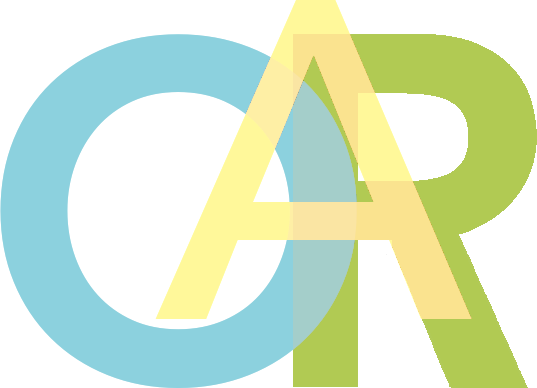

# Open Art Register

**Künstlerische Praxis wird auffindbar – und, wo freiwillig freigegeben, statistisch beschreibbar.**



## Deutsch

### Grundidee

Open Art Register entstand aus der Beobachtung, dass Künstlerinnen und Künstler
über Webseiten, Portfolios, soziale Netzwerke oder Ausstellungen sichtbar sein
können, ihre Arbeitsweisen, Themen und künstlerischen Schwerpunkte jedoch häufig
nur schwer gezielt recherchierbar sind.

Das Register versucht, diesen Rechercheprozess zu vereinfachen.

Open Art Register hat es sich zum Ziel gemacht, künstlerische Praxis strukturell
zu erfassen, ohne dafür eine möglichst umfangreiche Veröffentlichung von Werken
oder Inhalten vorauszusetzen.

Künstlerische Praxis kann dafür anhand einfacher strukturierter Angaben
beschrieben werden. Dazu gehören beispielsweise Tätigkeitsbereiche, Themen,
Techniken, Arbeitsweisen, der aktuelle Tätigkeitsstatus oder ein grundsätzliches
Interesse an Kooperationen.

Die Struktur soll keine vollständige kunstwissenschaftliche Beschreibung
voraussetzen und auch keine eindeutige Einordnung erzwingen. Unterschiedliche
Tätigkeitsbereiche, Themen und Arbeitsweisen können nebeneinander bestehen.

Die Einordnung der eigenen künstlerischen Praxis verbleibt bei der jeweiligen
Person.

Die Demonstration gibt einen Überblick über die bereits auf Open Art Register
umgesetzten Funktionen und deren Darstellung.

Auf der Demonstrationsseite selbst können Besucher keine Formularfelder
ausfüllen und keine produktiven Aktionen auslösen. Die automatisierten Tests
des öffentlichen Repositories bleiben davon unberührt und können die
vorgesehenen technischen Eigenschaften der Demonstration überprüfen.

[Demonstration ansehen](https://jerd0gan.github.io/open-art-register-evidence/)

### Strukturierte Auffindbarkeit

Open Art Register ersetzt keine eigene Webseite, kein Portfolio und keine
Social-Media-Präsenz.

Dort können weiterhin Werke, Ausstellungen, Bilder, Texte und andere Inhalte
gezeigt werden.

Das Register konzentriert sich auf einen anderen Teil:

**konzentriert recherchieren zu können, wer welche Arbeit macht.**

Eine Suche kann beispielsweise über einen künstlerischen Tätigkeitsbereich
beginnen und anschließend durch Themen, Techniken oder weitere Angaben
eingegrenzt werden.

Open Art Register soll dabei nicht entscheiden, ob eine Arbeit gefällt, wichtig
ist oder für ein bestimmtes Projekt geeignet erscheint.

Diese Entscheidung verbleibt beim Menschen.

Das Register soll zunächst helfen, das Gesuchte überhaupt zu finden.

## Kunst trifft Statistik

Durch die strukturierte Erfassung entsteht neben der Recherche eine zweite
Anwendungsebene:

**Statistik.**

Open Art Register verwendet Statistik nicht, um künstlerische Qualität zu
bewerten.

Die statistische Betrachtung soll vielmehr beschreiben können, wie sich dafür
freigegebene Angaben innerhalb des Registers verteilen.

Dazu können beispielsweise gehören:

- vertretene künstlerische Tätigkeitsbereiche,
- genannte Themen,
- verwendete Techniken oder Arbeitsweisen,
- Angaben zum aktuellen Tätigkeitsstatus,
- sowie weitere dafür vorgesehene statistisch nutzbare Merkmale.

Damit trifft ein schwer vollständig greifbares Arbeitsfeld an ausgewählten
Stellen auf strukturierte und quantitativ beschreibbare Angaben.

Die Statistik sagt dabei nicht, welche Arbeit gut oder schlecht, wichtig oder
unwichtig ist.

Sie beschreibt ausschließlich, was innerhalb des Registers tatsächlich
angegeben und für diese Form der Betrachtung freigegeben wurde.

Die Statistik-Demonstration zeigt beispielhaft die bereits auf Open Art Register
umgesetzte statistische Darstellung. Die dort verwendeten Werte sind
ausschließlich synthetische Beispieldaten.

[Statistik-Demonstration ansehen](https://jerd0gan.github.io/open-art-register-evidence/example-statistics.html)

### Unterschiedliche Nutzungsarten derselben Information

Eine Information besitzt innerhalb von Open Art Register nicht automatisch
überall dieselbe Funktion.

Eine Angabe kann beispielsweise

- Bestandteil einer persönlichen Eingabe sein,
- öffentlich dargestellt werden,
- für eine Suchstruktur verwendet werden,
- statistisch berücksichtigt werden,
- oder bewusst nur innerhalb eines bestimmten Zusammenhangs verbleiben.

Entscheidend ist deshalb nicht allein, ob eine Information vorhanden ist,
sondern auch, **für welchen vorgesehenen Zweck sie verwendet werden darf**.

Eine vorhandene oder gespeicherte Angabe wird damit nicht automatisch zu einer
öffentlichen oder statistisch nutzbaren Angabe.

**Gespeichert, öffentlich sichtbar und statistisch verwendet sind nicht
automatisch dasselbe.**

### Freiwilligkeit und Aussagegrenze

Die Teilnahme an der statistischen Auswertung ist freiwillig.

Eine Person kann Open Art Register zur eigenen Auffindbarkeit nutzen und
trotzdem entscheiden, nicht an der statistischen Betrachtung teilzunehmen.

Die daraus entstehenden Auswertungen dürfen deshalb nicht automatisch mit
„der Kunstwelt“ gleichgesetzt werden.

Sie beschreiben zunächst die Angaben der Personen, die innerhalb von Open Art
Register freiwillig an dieser Auswertung teilnehmen.

Ihre Aussagekraft hängt damit immer auch davon ab,

**wer teilnimmt, wie viele teilnehmen und welche Angaben tatsächlich vorliegen.**

### Selbstbestimmung

Wenn Informationen über Menschen und ihre künstlerische Tätigkeit strukturiert
erfasst werden, entsteht daraus Verantwortung.

Datenschutz und Selbstbestimmung werden deshalb nicht erst als technische
Anforderung am Ende des Projekts betrachtet, sondern als Bestandteil seiner
Grundstruktur.

Die registrierte Person soll selbst entscheiden können,

- welche dafür vorgesehenen Angaben sie macht,
- welche davon öffentlich sichtbar werden,
- und welche zusätzlich in die statistische Betrachtung einfließen dürfen.

---

# Public Demo & Git Transparency

## Über dieses Repository

Dieses Repository ist **nicht der vollständige produktive Quellcode von
Open Art Register**.

Es enthält einen bewusst begrenzten öffentlichen Demonstrations- und
Nachweisstand.

Der öffentliche Stand soll nachvollziehbar zeigen, wie ausgewählte sichtbare
Teile des Projekts aussehen und wie bestimmte öffentliche Grenzen technisch
geprüft werden können, ohne dafür interne Betriebsstrukturen oder den
vollständigen Anwendungscode zu veröffentlichen.

Öffentlich enthalten sind:

- eine statische Homepage-Demo im OAR-Stil,
- eine statische Beispiel-Statistikansicht,
- ein DE/EN-Sprachumschalter auf beiden Demo-Seiten,
- das ausdrücklich freigegebene OAR-Logo,
- lokale Sicherheits- und Boundary-Tests,
- sowie ein bewusst begrenzter öffentlicher Health-Nachweis.

## Demo

Die beiden statischen Ansichten befinden sich unter:

- [`site/index.html`](site/index.html) – Homepage-Demo
- [`site/example-statistics.html`](site/example-statistics.html) – Beispiel-Statistik

In den Demo-Seiten ist **nur die Sprachauswahl DE / EN bedienbar**.

Registrierung, Anmeldung, Suche, Filter, Formulare und weitere produktive
Bedienelemente sind deaktiviert.

Es werden keine produktiven API-, Authentifizierungs-, Passkey- oder
Datenbankfunktionen in die Demo eingebaut.

Beide Demo-Seiten tragen ein gelbes halbtransparentes, am Browserfenster
fixiertes Hinweisband.

Die Statistikansicht ist zusätzlich als **BEISPIEL / EXAMPLE** gekennzeichnet
und verwendet ausschließlich synthetische Beispieldaten.

Es werden dort keine echten Open-Art-Register-Daten dargestellt.

## Git Transparency

Für Open Art Register bedeutet Transparenz nicht, dass jede intern vorhandene
Information automatisch veröffentlicht werden soll.

Ein technischer Nachweis kann intern vollständig sinnvoll sein und trotzdem
Informationen enthalten, die für eine öffentliche Überprüfung nicht benötigt
werden.

Deshalb wird zwischen unterschiedlichen Darstellungsformen und
Verwendungsgrenzen unterschieden.

Vereinfacht gilt:

**Open Evidence ist nicht gleich Open Operations.**

Öffentliche Nachweisbarkeit soll möglich sein, ohne daraus automatisch eine
Offenlegung interner Betriebsstrukturen abzuleiten.

Dieses Repository enthält deshalb insbesondere keine vollständige produktive
Anwendungsquelle, keine Zugangsdaten, keine privaten Schlüssel und keine
internen Betriebsinformationen.

## Öffentliche Boundary-Prüfung

Der Repository-Boundary-Test arbeitet fail-closed.

Das bedeutet:

Eine Datei gehört nicht deshalb zum öffentlichen Stand, weil sie technisch
vorhanden oder grundsätzlich interessant wäre.

Sie muss ausdrücklich Bestandteil des vorgesehenen öffentlichen Umfangs sein.

Nicht freigegebene zusätzliche Dateien führen zur fehlgeschlagenen
Boundary-Prüfung.

Die produktiven OAR-Bereiche sind in diesem öffentlichen Stand ausgeschlossen;
ebenso sensitive Dateinamen sowie dafür nicht vorgesehene Archiv-, Schlüssel-
und Datenbankformate.

## Lokale Tests

Voraussetzung:

- Node.js >= 24
- keine externen npm-Abhängigkeiten erforderlich

Ausführen:

```bash
npm test
```

Die Tests prüfen unter anderem die begrenzte Interaktivität der Demo,
synthetische Statistikdaten, den vorgesehenen öffentlichen Dateiumfang und den
öffentlichen Health-Vertrag.

## Öffentlicher Health-Nachweis

Der GitHub-Workflow verwendet ausschließlich den bereits öffentlichen,
sanitisierten Health-Pfad:

`https://openartregister.art/api/health`

Der öffentliche Prüfpfad benötigt keine Zugangsdaten und führt keine
Schreiboperation aus.

Bei einem erfolgreichen Lauf werden ausschließlich folgende Werte dargestellt:

```text
DATABASE=UP
READ_PATH=PASS
END_TO_END_MS=<Millisekunden>
CHECKED_AT=<UTC-Zeitstempel>
```

`END_TO_END_MS` bezeichnet die vollständige öffentliche Ende-zu-Ende-Zeit der
Anfrage.

Der Wert ist **keine reine Datenbanklatenz**.

Kann der Zustand nicht zuverlässig festgestellt werden, wird kein positiver
Datenbankzustand geraten.

## Projekt

Öffentlicher Webauftritt:

[https://openartregister.art](https://openartregister.art)

---

## English

### Basic idea

Open Art Register grew out of the observation that artists can be visible
through websites, portfolios, social networks or exhibitions while their
working methods, subjects and artistic focus can still be difficult to research
in a targeted way.

The register is intended to make this research easier.

Open Art Register aims to record artistic practice in a structured form without
requiring artists to publish as many works or other contents as possible.

Artistic practice can therefore be described through simple structured
information such as fields of activity, subjects, techniques, working methods,
current activity status or a general interest in collaboration.

The structure does not require a complete art-historical description and is not
intended to force artistic practice into one exclusive category.

Different fields, subjects and working methods may exist alongside each other.

The classification of an artistic practice remains with the person providing
the information.

The demonstration provides an overview of the functions already implemented
in Open Art Register and how they are presented.

On the demonstration page itself, visitors cannot fill in form fields or
trigger production actions. This does not affect the automated tests in the
public repository, which can verify the intended technical properties of the
demonstration.

[View demonstration](https://jerd0gan.github.io/open-art-register-evidence/)

### Structured discoverability

Open Art Register does not replace an artist's own website, portfolio or social
media presence.

Those places can continue to present works, exhibitions, images, texts and
other material.

The register focuses on a different task:

**making it possible to research in a concentrated way who does what kind of
work.**

A search may begin with an artistic field and then be narrowed through subjects,
techniques or other information.

Open Art Register does not decide whether a work is good, important or suitable
for a particular project.

That decision remains human.

The register is intended to help people find what they are looking for in the
first place.

## Art meets statistics

Structured information creates a second application layer alongside research:

**statistics.**

Open Art Register does not use statistics to evaluate artistic quality.

Instead, statistical views may describe how information explicitly made
available for that purpose is distributed within the register.

This can include, for example:

- represented artistic fields,
- stated subjects,
- techniques and working methods,
- current activity status,
- and other information intended for statistical use.

In this way, selected aspects of a field that is difficult to describe in its
entirety can meet structured and quantitatively describable information.

The statistics do not state which work is good or bad, important or
unimportant.

They describe only information that has actually been provided within the
register and made available for this form of analysis.

The statistics demonstration provides an example of the statistical
presentation already implemented in Open Art Register. All values shown there
are synthetic example data.

[View statistics demonstration](https://jerd0gan.github.io/open-art-register-evidence/example-statistics.html)

### Different uses of the same information

Information within Open Art Register does not automatically have the same
function everywhere.

An item of information may be

- part of a personal entry,
- released for public presentation,
- used as part of a search structure,
- included in statistical analysis,
- or deliberately limited to another specific context.

The relevant question is therefore not only whether information exists, but
also **for which intended purpose it may be used**.

Stored information does not automatically become public or statistically
usable information.

**Stored, publicly visible and statistically used are not automatically the
same thing.**

### Voluntary participation and limits of interpretation

Participation in statistical analysis is voluntary.

A person may use Open Art Register for discoverability while deciding not to
participate in statistical analysis.

The resulting statistics must therefore not automatically be interpreted as
representing “the art world”.

They initially describe the information provided by people who voluntarily
participate in this form of analysis within Open Art Register.

Their significance consequently depends on

**who participates, how many participate and which information is actually
available.**

### Self-determination

Structuring information about people and their artistic practice also creates
responsibility.

Data protection and self-determination are therefore treated as part of the
project's underlying structure rather than as a purely technical requirement
added at the end.

Registered users should be able to decide

- which intended information they provide,
- which information becomes publicly visible,
- and which information may additionally be used for statistical analysis.

---

# Public Demo & Git Transparency

## About this repository

This repository is **not the complete production source code of Open Art
Register**.

It contains a deliberately limited public demo and evidence snapshot.

The public snapshot is intended to make selected visible aspects of the project
and certain public verification boundaries understandable without publishing
the complete application source or internal operational structures.

Public contents are limited to:

- a static OAR-style homepage demo,
- a static example statistics view,
- a DE/EN language switch on both demo pages,
- the explicitly approved OAR logo,
- local security and boundary tests,
- and a deliberately limited public health check.

## Demo

The static demo files are:

- [`site/index.html`](site/index.html) – homepage demo
- [`site/example-statistics.html`](site/example-statistics.html) – example statistics

On both demo pages, **DE / EN language selection is the only interactive
control**.

Registration, sign-in, search, filters, forms and other production controls are
disabled.

No production API, authentication, passkey or database application logic is
included in the demo.

Both demo pages contain the same semi-transparent yellow notice tape fixed to
the browser viewport.

The statistics page is additionally marked **EXAMPLE / BEISPIEL** and uses
synthetic example data only.

No real Open Art Register data is displayed there.

## Git Transparency

Transparency in Open Art Register does not mean that every internally available
piece of information should automatically become public.

Technical evidence may be useful and complete internally while still containing
information that is unnecessary for public verification.

For that reason, different forms of evidence and disclosure boundaries are
distinguished.

In short:

**Open Evidence is not Open Operations.**

Public verifiability should be possible without automatically disclosing
internal operational structures.

This repository therefore does not contain the complete production application
source, credentials, private keys or internal operational information.

## Public repository boundary

The repository boundary check follows a fail-closed approach.

A file is not considered public merely because it exists or may be technically
interesting.

It must explicitly belong to the intended public scope.

Unexpected additional files cause the boundary check to fail.

Productive OAR areas are excluded from this public snapshot, as are sensitive
filenames and archive, key and database file types that are not intended for
publication.

## Local tests

Requirements:

- Node.js >= 24
- no external npm dependencies

Run:

```bash
npm test
```

The tests cover, among other things, the limited demo interaction, synthetic
statistics data, the intended public file boundary and the public health
contract.

## Public health evidence

The GitHub workflow accesses only the already public and sanitized health path:

`https://openartregister.art/api/health`

The public check requires no credentials and performs no write operation.

On success, only the following values are displayed:

```text
DATABASE=UP
READ_PATH=PASS
END_TO_END_MS=<milliseconds>
CHECKED_AT=<UTC timestamp>
```

`END_TO_END_MS` describes the full public end-to-end request time.

It is **not a database-only latency measurement**.

If the database state cannot be reliably determined, the public check does not
invent a positive database status.

## Project

Public website:

[https://openartregister.art](https://openartregister.art)

---

## Lizenz / License

Der veröffentlichte Demo- und Nachweiscode bleibt proprietär.
Maßgeblich ist [`LICENSE`](LICENSE).

The published demo and evidence code remains proprietary.
See [`LICENSE`](LICENSE).
